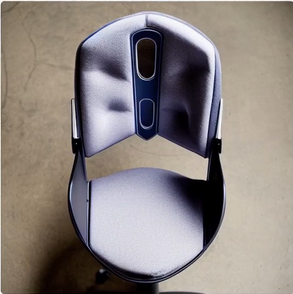

# This Project is made by Amine EL HEND and Mouad BOULAID

## Problem of traditional product design with Dfx
Whenever a product is getting made, it must go through a phase in which the industrial designers make prototypes and try to represent the product the customer is willing to buy.

Through that phase, there's a repetitive process that the product goes through, mainly:

1 - Defining The Product
-  
Designers need only to have an idea of what item or product
they want to design. By having an idea of what the product is, identifying what the
customer needs and the Dfx aspect to respect and what’s trending in the market, they can easily decide what’s required in the product in order for it to be successful.

2 - Idea Generation
-
After defining what is needed. Designers traditionally start making different sketches of how the product can look like. They try to specify the shape and what exactly is needed in order to make the product respect all the aspects the client (or the market) requires.

3- Screening of the Idea
-
Having the idea generated and its visualization, designers need to know if it corresponds to what they want (DFX). There are multiple ways to evaluate the image generated. 

For example : if the product is an innovative table, with some complex shape and we want to "Design For Reliability". It needs to be verified when it comes to the resistance of the structure and many other things... This can be done by using different softwares (Catia for example), or by doing alpha/beta testing.

---

Now the problem with all of this is that, ***each step takes a LOT OF TIME***, and there are contraints when it comes to that. If a product is made very fast it's most likely going to not respect the exaggerations of the user. If it takes a long time, competitors will win our clients...

So Designers must find a faster efficient way to design good innovative reliable products!

## Generative AI in product design

After defining the problem, one of the things that come to mind nowadays when trying to find fast solutions is basically using AI, right? But how exactly can we use AI ?
That's the **PURPOSE** of our project.

In this project we try to find ways in which we can apply GenAI to make product designing *faster, efficient* and most importantly ***RELIABLE***.

Generative AI is taking over day by day.. Each week, new AI Models and updates come out and change the world's point of view when it comes to the traditional ways of doing stuff.

So in this project, we're willing to use GenAI models in order to simplify the tasks and do them very fast!

## How are we integrating GenAI ?


### - Step 1:  Prompt generation

This reflects the "Defining The Product" step in traditional design, except that this is possible for everyone to do and not only industrial designers. By the use of an LLM (Mistral in our case), you can have an innovative idea from scratch, or you can just write your own...
But since we're using another model for image generation, we can't just use a simple line such as "Make an innovative simplistic design of a chair". The image generation model needs details to respect them and not make something weird not following the guidelines needed.

So we simply use an LLM of choice, in order to paraphrase the user's input and help generating a good image.


### - Step 2:  Model Loading

In this step, we choose which image generation model to use (StableDiffusion 1.5 if you don't have enough ressources and want fast generations, StableDiffusion XL if you have high Vram and want very good images of products => high quality ...etc.). Then we load the image generation model.

If you have already a sketch or an image of a product you want to use as a reference, then in this case you will load "ControlNet" Model as well, in order to make the mask of the product and guide the image generation model.. 

### - Step 3:  Image Generation

The image simply gets generated and the user would have to rate it based on the Dfx aspect and also accept it or not... Because the product might respect the Dfx aspect but the image isn't good looking.

### - Step 4:  Dfx Report

Now that the image is generated, Mistral generates a report explaining how the product generated respects the DFX aspect, allowing the user to be more creative and confident of what they can make...


# Models Used

## Image Generation

- Stable Diffusion v1.5
- Stable Diffusion v2.1
- Stable Diffusion XL
- OpenJouerney v4
- ControlNet (for input images mask)

## Text Generation

- Mistral


# Tools Required To Run The Project

- Python
- Streamlit
- Ollama
- Transformers
- Diffusers
- Torch ( if you have an NVIDIA Graphics card, Make sure your system has: NVIDIA driver >= 515 & CUDA 11.8 toolkit // Check the requirements.txt ) (optional; not needed if using PyTorch's bundled runtime)
- Pillow
- Pandas

All of these can be installed by running the following command:

```
pip install -r requirements.txt
```


## Mistral (LLM of choice)

To install mistral locally you can just go to : [Ollama website](https://ollama.com/download)

After installing Ollama, open the terminal and use :

```ollama run mistral```

and it's going to be installed automatically and ready to use. Or you can just use:

```ollama pull mistral```

# WARNING

*When trying to run the project locally, make sure to change the variable ``` sdcache_directory``` into the location where you want to install the cache of all the image generation models...*

### IF YOU WANT TO USE ALL THE IMAGE GENERATION MODELS IT'S GONNA TAKE A LOT OF SPACE (~100GBs or more)

# HOW TO RUN THE APPLICATION

after installing the required libraries. You should 

- Put the `config.toml` file in the streamlit cache in order to use the theme we made. (default location is: `C:\Users\(your user)\.streamlit\`).
- open the `GENAI-DFX.py` file in vscode or directly open terminal in that location.
- run in the terminal `streamlit run GENAI-DFX.py` and you will go directly to this page:


- Explore the app however you want!!!

# Illustrative Examples

## Text-To-Image
- Prompt: ”an angular industrial speaker with a distinctive hexagonal prism design,
marrying sleek contours with robust mechanical elements for a striking silhouette that
defies traditional loudspeaker conventions., professional product visualization, studio
lighting,high detail”.

- Model used : SDXL
- Image generated: 
  


## Sketch-To-Image

- Sketch : 


- Prompt: ”A gaming mouse”
- Model: Stable Diffusion 1.5 (with ControlNet)
- Image generated:
  


## EXTENSION OF SKETCH-2-IMAGE

Now after seeing the example you might be wondering if you could do **"MORE"** than just follow in a straight way the guidelines of the sketch... 

WELL, the answer is ***YES***! You can make anything you want by changing the prompt and giving the sketch.

- Let's keep the sketch used before and use a different prompt.
- Prompt: "Chair"*
- Image Generated:
  



# Comparison of models used

| Model Selected       | Expected Image Type / Characteristics                                                                 | Sketch-to-Image Support            |
|----------------------|--------------------------------------------------------------------------------------------------------|------------------------------------|
| Stable Diffusion 1.5 | Good balance of quality/speed, general purpose.                                                        | Yes (with ControlNet)              |
| Stable Diffusion 2.1 | Improved detail consistency over 1.5.                                                                  | Yes (with ControlNet)              |
| Stable Diffusion XL  | High detail, excellent composition, photorealistic.                                                    | No (as per current code)           |
| SDXL Turbo           | Very fast generation, suitable for rapid iteration, potentially lower detail.                          | No (as per current code)           |
| OpenJourney v4       | Midjourney-like aesthetic, artistic, good for conceptual product design.                               | Yes (with ControlNet)              |

Time Comparison
---
| Model Selected       | Approx. Generation Time (6GB VRAM) | Notes                                                                 |
|----------------------|-------------------------------------|-----------------------------------------------------------------------|
| Stable Diffusion 1.5 | ~2–16 seconds                        | Efficient and lightweight, good performance on mid-tier GPUs.         |
| Stable Diffusion 2.1 | ~2–16 seconds                       | Slightly more demanding than 1.5 due to improved detail rendering.    |
| Stable Diffusion XL  | ~800 seconds                      | Heavy model; may require offloading or optimization to run on 6GB.    |                      |
| OpenJourney v4       | ~2–20 seconds                       | Heavier than SD 1.5/2.1; artistic rendering can take more resources.  |
